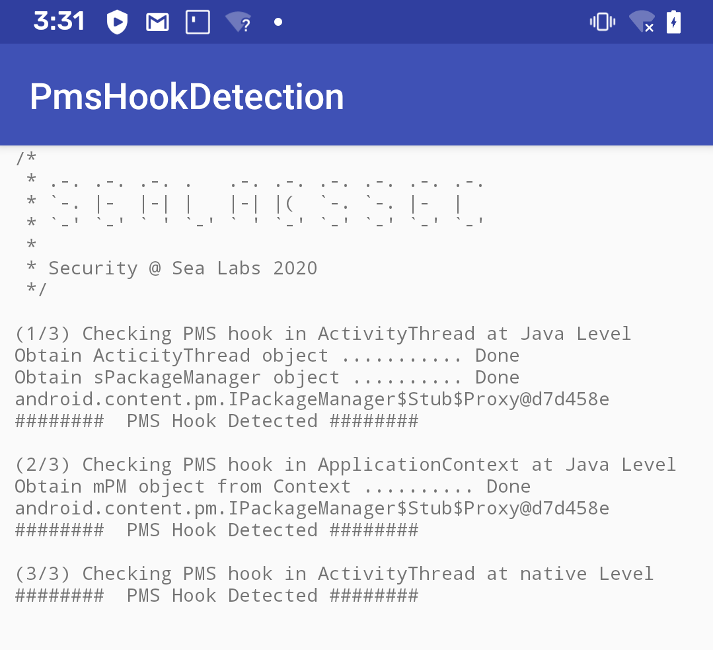

Android PMS Hook Detection
=========
This is a proof-of-concept(PoC) project on detecting hooks in Android's PackageManagerService(PMS). PMS hook is a common way to bypass signature checks on Android apks. 

The PoC comprises of two parts:
- Ported a typical PMS hook from MT Manager(binmt.cc) and replaced the default Application class in manifests
- Implemented PMS hook detection methods in both Java and native layers

#### TO-DOs
- [x] Detect hook in ActivityThread in Java
- [x] Detect hook in ApplicationContext in Java
- [x] Detect hook in ActivityThread in native
- [ ] Detect hook in ApplicationContext in native
- [ ] Recover PMS instance after hooking

Screenshots
-----------

Getting Started
---------------
1. [Download Android Studio](http://developer.android.com/sdk/index.html)
1. Launch Android Studio.
1. Open the sample directory.
1. Open *File/Project Structure...*, click *Download* or *Select NDK location*.
1. Click *Tools/Android/Sync Project with Gradle Files*.
1. Click *Run/Run 'app'*.

References
---------------
http://weishu.me/2016/03/07/understand-plugin-framework-ams-pms-hook/
